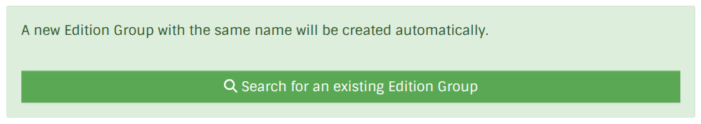

# Edition Group

[TOC]

## What is an Edition Group?
And why do we even need them?

- Issue about what to put in what Edition Group

##  How do I create Edition Groups
Usually, you do not need to create an Edition Group manually, but rather one will be created automatically when you create the first Edition of that publication

However power users may want to create an Edition Group first for a book they know exists, but don't have an actual Edition for at hand.
We discourage this unless you are ready to add Editions, as it is possible another user will not realize an Edition Group already exists for their publication. 

## When do I create a separate Edition Group?
How/When to create a different Edition Group than what is auto suggested (I feel the actual datamodels code here is kinda unevolved and we should do better (more like mb))

## Linking Edition Groups to other entities
Well... we don't, really.
The Edition Groups are a logical grouping representing the idera of "a book" rather than a specific item, so we have no direct relationships to Edition Groups

However, you can add Edition Groups to a Series
### Link to Series
See [series section](./series.md)

### Link to Author
We don't create a relationship between an Edition Group and their Author, instead this information is recorded as [Author Credits](./edition.md#author-credit) like we do for Editions.
Usually, when first created an Edition Group will have the same Author Credits as the Edition it is created for, but it can also be modified sseparately if required.

Similarly, you should be able to copy any changes you make to an Edition's Author Credit directly to its Edition Group (this is under development).
