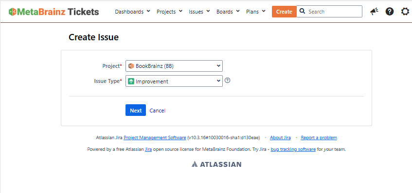
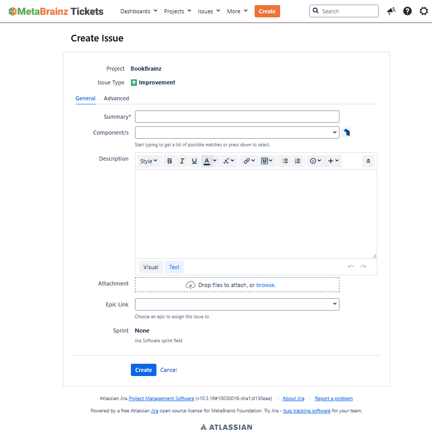

## How to suggests changes aka JIRA tickets

Sometimes you'll find that a book or situation details a relationship that can't be adequately covered by the pre-existing BookBrainz relationships - something new.
What do you do then? 
Well there are several ways to go about it, the best method is to talk about it in our [forum](https://community.metabrainz.org/c/bookbrainz/)- maybe others have come across the same issue as you, or can point you to the correct relationship. 
However sometimes we don't yet *have* the right relationships! 
You can also discuss that on the forum also. 
When the need arises you can create a ticket to ask for the inclusion of a new relationship! 

**Here is how to do it:** 
Go to [our bugtracker (JIRA)](https://tickets.metabrainz.org/secure/CreateIssueDetails!init.jspa?pid=10043&issuetype=4&summary=Put%20a%20good%20explanation%20here!&components=11309), you can create a new user or just log-in with your MetaBrainz account. 
Here you'll be met with the following screen:

Press next and then this screen will greet you:

Here in "Summary" you should  write a succinct description of the issue, e.g. "Create new relationship: author credits pet" (don't actually ask for pet relationships!) 
For Component select "Relationships" in the dropdown. 
In Description you should add a detailed explanation for what you want this new relationship to *solve*: Why are the already existing relationships not covering this? Suggestions, links and more descriptions are always a good idea! 

When done, finally click "Create" and that's it! 
Remember you can link and still discuss this on the forum!
