# Series 
-------
A series is a sequence of separate works, authors, editions, edition groups, or publishers with a common theme. The theme is usually prominent in the branding of the entities in the series and the individual entities will often have been given a number indicating the position in the series.

### Examples

<!-- update the examples with bookbrainz.org url once the series feature is released.  -->

- [The Lord of the Rings](https://test.bookbrainz.org/series/8868b54c-3d85-4067-aacc-63c3fc0c4b01)
- [Harry Potter](https://test.bookbrainz.org/series/e9ffde6e-ffa7-4fe3-b8c5-e548bcbcc938)

### Series Type
The type primarily describes what type of entity the series contains. A series can only contain a single type of entity; mixed entity types are not supported. The possible values are:

- Work 
- Author 
- Publisher
- Edition
- Edition group 

### Ordering type
The ordering type determines whether the series is ordered automatically or manually.

### Creating a series

**1)** Navigate to the series entity editor page by clicking the **series** link from the **+ Add** dropdown menu list.

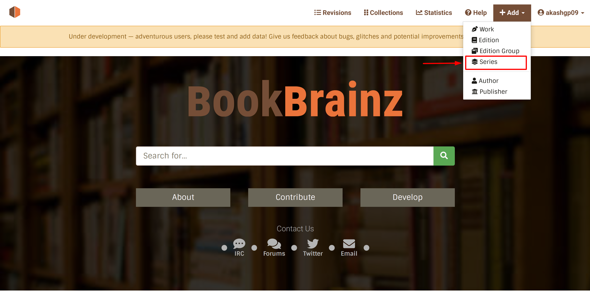

-------
2) Let's create a series [**The Lord of the Rings**](https://en.wikipedia.org/wiki/The_Lord_of_the_Rings), an epic high fantasy novel by the English author and scholar **J. R. R. Tolkien**.

- Give the series a name, sort name, and the language.
- Select the ordering type of the series from the dropdown list. (default is **Automatic**)
- Select the type of the series from the series type dropdown list. (default is **Work**)

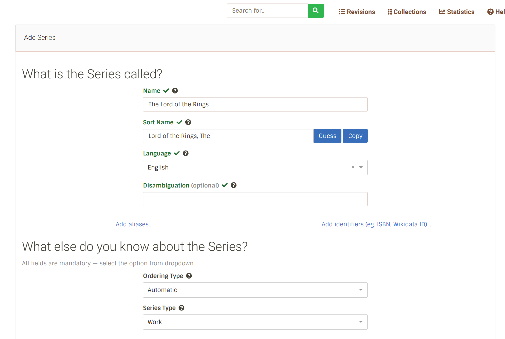

-------
**3)** <em>The Lord of the Rings</em> has 3 volumes.

- Chapter 1: The Fellowship of the Ring
- Chapter 2: The Two Towers
- Chapter 3: The Return of the King

Let's add these works to the series.

Search for the works and add them to the series.

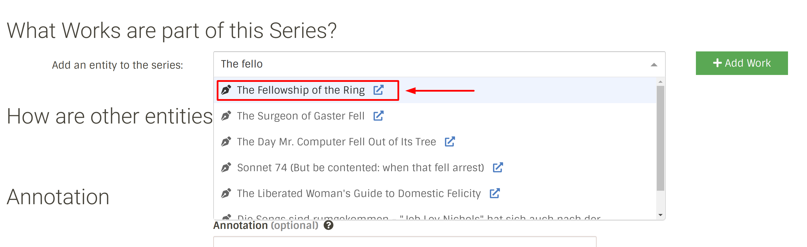

------
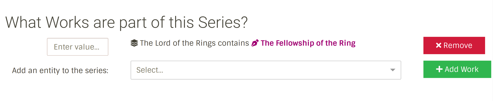

continue the same process for the other two works and add them to the series.

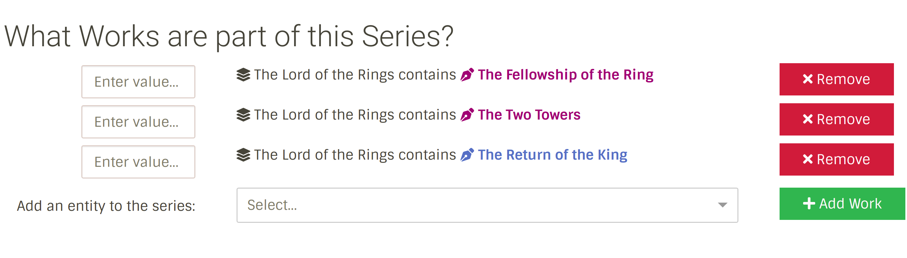

Give each work a number, indicating their sequence in the series. For example: <em>**The Fellowship of the Ring**</em> is the first chapter of the series, we can assign it a value 1, and so on for the other two works.

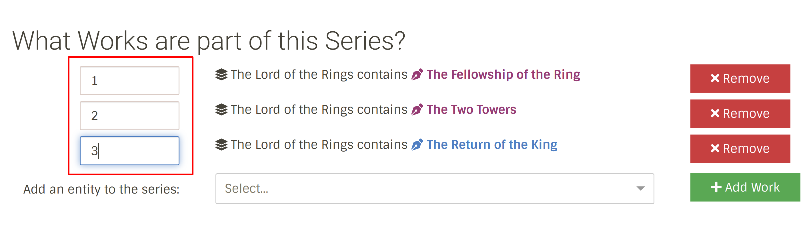

**Note:** You are not limited to numeric values, this is a free text field. In this case, we could have assigned "Book One", "Book Two" and "Book Three" instead of 1,2,3.

-------
**4)** Add relationship(if any) and annotation for the series. Then finally click on the **Submit** button.

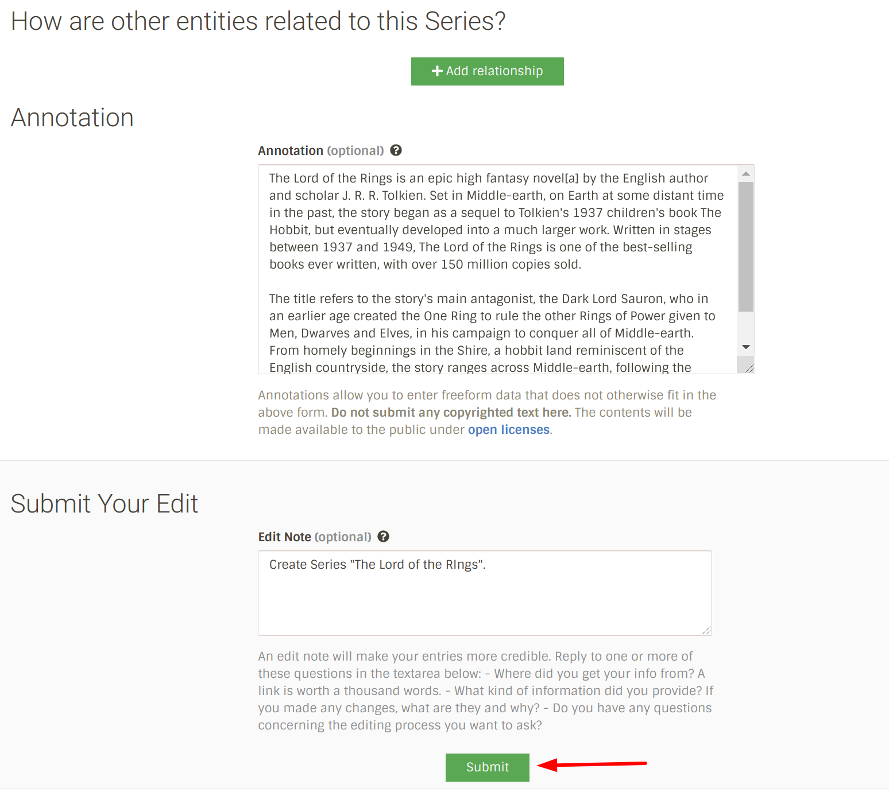

After submission, you will be redirected to the series page.

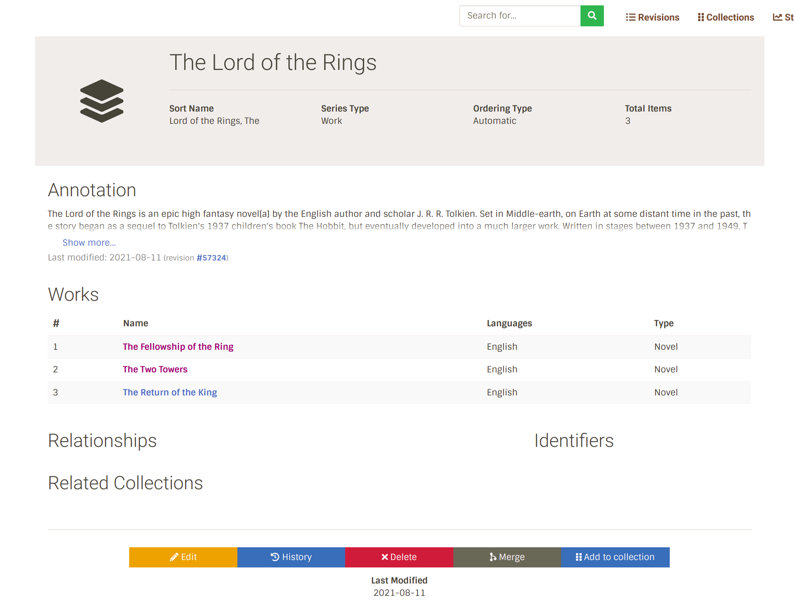

-------
### When to use Manual as Ordering Type ?

When the ordering type is **Automatic**, the series will be ordered in ascending order of the number attribute value assigned to the works.

Using **Manual** ordering type offers more control over the ordering of the items in the series.
You can use the drag and drop tool to order the items in the series in any way you want.

Let's see this in action.

[The Hobbit](https://en.wikipedia.org/wiki/The_Hobbit) is a prequel to the series <em>The Lord of the Rings</em>. Let's add it to the series.

Edit the series and add the work to the series.

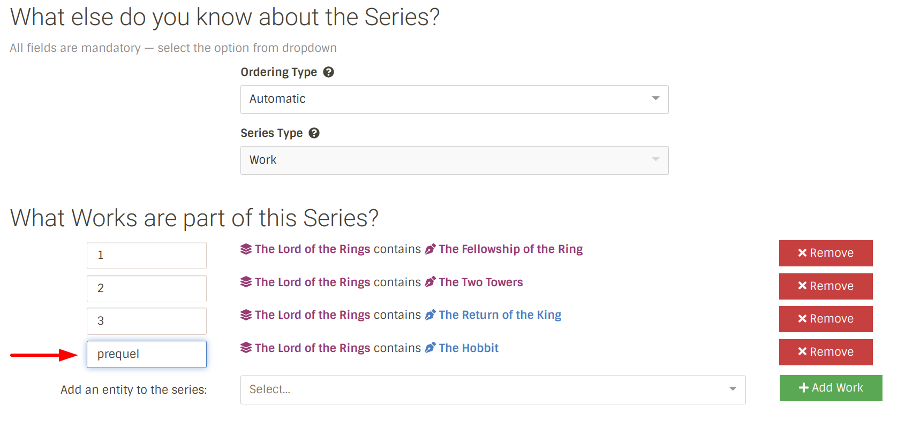

Oh! The Hobbit at bottom of the list does not match the series order. It would have beeen better if it was at the top of the list.

But, How to move it to the top? 

- Change the ordering type to **Manual** and use the drag and drop tool to move it to the top.

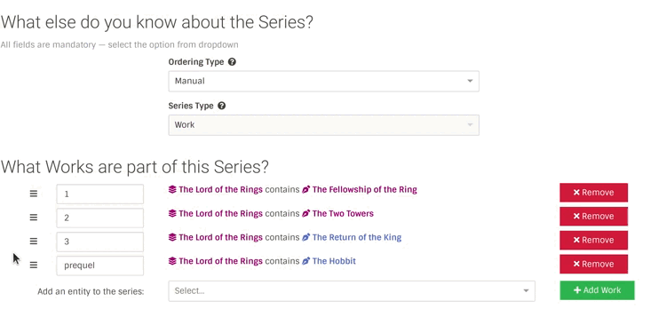

Now submit the changes.

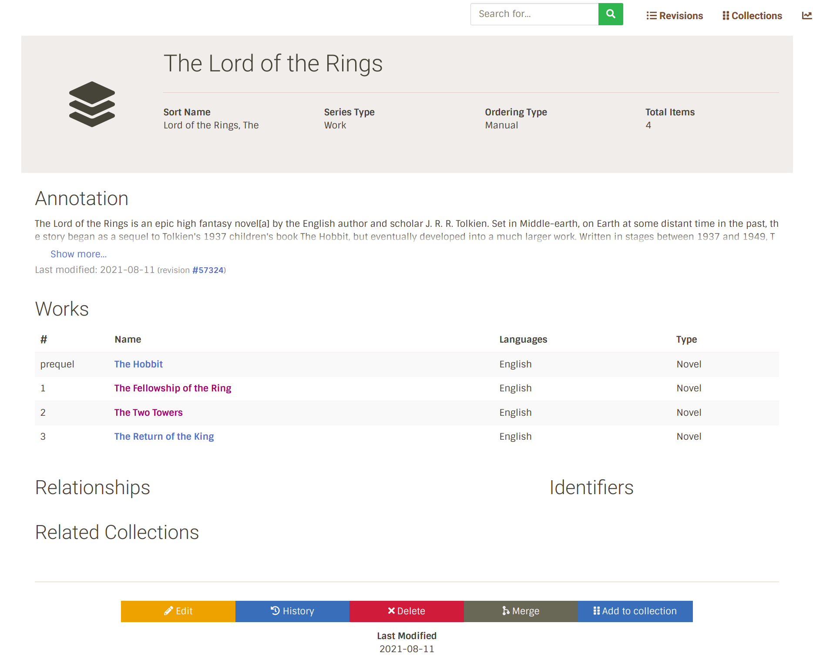

-------
